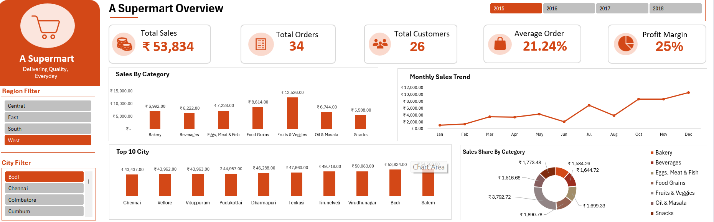

# 🛒 Supermart Sales Dashboard

## 📌 Project Overview

This project is an interactive Sales Dashboard built in Microsoft Excel to analyze Supermart sales performance. The dashboard transforms raw sales data into meaningful business insights using data cleaning, data modeling, and interactive visualizations.

It enables users to monitor sales performance, identify top-performing categories and cities, and analyze trends using dynamic filters.

---

## 🚀 Features

- Interactive Dashboard
- KPI Cards (Total Sales, Orders, Customers, AOV & Profit Margin)
- Monthly Sales Trend Analysis
- Sales by Category
- Top 10 Cities by Sales
- Category-wise Sales Distribution
- Dynamic Region, City and Year Slicers

---

## 🛠️ Tools & Technologies

- Microsoft Excel
- Power Query
- Pivot Tables
- Pivot Charts
- DAX Measures
- Data Modeling
- Slicers
- Data Visualization

---

## 📈 Key Insights

- Monitored overall sales performance using KPI cards.
- Compared sales across different product categories.
- Identified top-performing cities by sales.
- Analyzed monthly sales trends.
- Used interactive slicers to filter data by Region, City, and Year.

---

## 📂 Repository Contents

<a href="https://github.com/DhruvKohli123/Supermart-Sales-Dashboard/blob/main/Dashboard.png">🖼️ Dashboard Screenshot</a>

<a href="https://github.com/DhruvKohli123/Supermart-Sales-Dashboard/blob/main/Supermart%20Sales%20Dashboard.xlsx">📊 Supermart Sales Dashboard.xlsx</a>

<a href="https://github.com/DhruvKohli123/Supermart-Sales-Dashboard/blob/main/Supermart_Dataset.csv">📁 Supermart Dataset.csv</a>

---

## 👨‍💻 Author

**Dhruv Kohli**
Aspiring Data Analyst | Excel | SQL | Power BI | VBA
